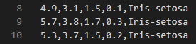

<h1 align="center">Documentação</h1>

	O trabalho constitui de um sistema de classificação cujas características serão utilizadas para observar conceitos importantes como: escalonamento e gestão de memória primária. No sistema será utilizado dois arquivos, D e T. A base D será utilizada para simular a inicialização, fornecendo assim o conceito de bootstrapping, tal como no sistema operacional. Já a base T representará os processos a serem executados, cada um produzindo uma série de computações pesadas e necessárias, as quais serão utilizadas por um sistema de escalonamento em dois níveis: mecanismo e política.

# Etapas do sistema

- O sistema será trabalhado em 6 etapas que podem ser conferidas a seguir

## Etapa I

- Na etapa I é trabalhado a tokenização e mapeamento do arquivo `D`, fazendo a leitura linha a linha do arquivo onde as 4 primeiras colunas irá representar as chaves da hash `itens`, possuindo as linhas onde as chaves aparecem como valores, e a coluna 5 irá reprentar as `classes`.

  - Como as chaves dos itens podem repetir em colunas diferentes, a indexação será feita de forma separada, ou seja, se um item aparece na coluna 1 e 3 com valor 23.4, a chave da hash sera (1,23.4) e (3,23.4) sem os parenteses

- [Exemplo] Ao fazer a leitura das linhas `8, 9 e 10` a tokenização será feita da seguinte maneira

- Faz a leitura da linha `8` e chama um metodo de tokenização, que irá separar a string em varios tokens utilizando a `,` como separador, cada token será utilizando como chave adicionando a linha `8` em um vetor de valores para cada item. O mesmo processo será realizado na linha `9` e `10`.

- Após o processamento das linhas acima, a hash dos `itens` ficará da seguinte maneira.

  - `1,4.9` -> 8
  - `2,3.1` -> 8
  - `3,1.5` -> 8, 10
  - `4,0.1` -> 8
  - `1,5.7` -> 9
  - `2,3.8` -> 9
  - `3,1.7` -> 9
  - `4,0.3` -> 9
  - `1,5.3` -> 10
  - `2,3.7` -> 10
  - `4,0.2` -> 10

- Já a hash das `classes` será a seguinte
  - `Iris-setosa` -> 8, 9, 10

## Etapa II

## Etapa III

## Etapa IV

## Etapa V

## Etapa VI
