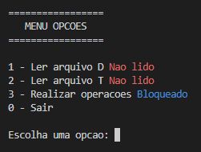

# Processos e treads

	O trabalho constitui de um sistema de classificação cujas características serão utilizadas para observar conceitos importantes como: escalonamento e gestão de memória primária. No sistema será utilizado dois arquivos, D e T. A base D será utilizada para simular a inicialização, fornecendo assim o conceito de bootstrapping, tal como no sistema operacional. A base T irá representar os processos a serem executados.

## Documentação

- Mais informações sobre o problema do trabalho pode ser encontrado em [Documentação](https://github.com/danieldiv/processos-e-treads/blob/main/README-DOC.md)

## Menu

- Ao executar o programa tera as seguintes opções:

  - `0` - Finalizar o programa
  - `1` - Realizar a leitura do arquivo [D](https://github.com/danieldiv/processos-e-treads/blob/main/src/files/D.csv)
  - `2` - Realizar a leitura do arquivo [T](https://github.com/danieldiv/processos-e-treads/blob/main/src/files/T.csv)
  - `3` - Fazer as operacoes envolvendo os arquivod `D` e `T`

## Sistema multitarefa: Etapa I

- Na etapa I é realizada a leitura e tokenização do arquivo `D`. O arquivo sera [tokenizado](https://github.com/danieldiv/processos-e-treads/blob/main/src/util.hpp#L44) em 5 colunas que representam as chaves e as linhas representam os valores. As 4 primeiras colunas serão utilizadas como chaves dos itens e a ultima coluna sera utilizada como chave da classe.

## Sistema multitarefa: Etapa II

- Na etapa II é realizada a leitura, tokenização e processamento do arquivo `D`. O arquivo sera [tokenizado](https://github.com/danieldiv/processos-e-treads/blob/main/src/util.hpp#L82) linha a linha utilizando as colunas como valores e linha como chave.

## Sistema multitarefa: Etapa III

- Para executar a etapa III é necessario liberar a opção `3`, que ficará bloqueada até fazer a leitura dos arquivos `T` e `T`. Nesta etapa é feita a operação para encontrar a classe da tarefa em T.

- Ao executar a opção `3` será feita a permutação das `tarefasT` com os `itens`, imprimindo no resultado as linhas com as possiveis classes.
  - Neste teste teve um acerto de 72% das 50 linhas do arquivo `T`, as diferenças podem ser conferidas em [diferencas](https://github.com/danieldiv/processos-e-treads/blob/main/src/files/diferencas).

# Compilação e Execução

| Comando    | Função                                                                                  |
| ---------- | --------------------------------------------------------------------------------------- |
| make clean | Apaga a última compilação realizada contida na pasta build                              |
| make       | Executa a compilação do programa utilizando o g++, e o resultado vai para a pasta build |
| make run   | Executa o programa da pasta build após a realização da compilação                       |
