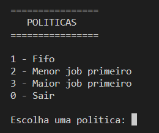

Documentacao pode ser encontrada em [Wiki](https://github.com/danieldiv/processos-e-threads/wiki)

# Processos e treads

	O trabalho constitui de um sistema de classificação cujas características serão utilizadas para observar conceitos importantes como: escalonamento e gestão de memória primária. No sistema será utilizado dois arquivos, D e T. A base D será utilizada para simular a inicialização, fornecendo assim o conceito de bootstrapping, tal como no sistema operacional. A base T irá representar os processos a serem executados.

## Menu

- A opção 1 realizada todas as etapas e apresenta as classes encontradas bem como o tempo contabilizado da leitura, processamento e intercessoes.

## Sistema multitarefa: Etapa I

- Na etapa I é realizada a leitura e tokenização do arquivo `D`. O arquivo sera [tokenizado](https://github.com/danieldiv/processos-e-threads/blob/main/src/include/template/util.hpp#L55) em 5 colunas que representam as chaves e as linhas representam os valores. As 4 primeiras colunas serão utilizadas como chaves dos itens e a ultima coluna sera utilizada como chave da classe.

## Sistema multitarefa: Etapa II

- Na etapa II é realizada a leitura, tokenização, [processamento](https://github.com/danieldiv/processos-e-threads/blob/main/src/kernel.cpp#L24) e [combinação](https://github.com/danieldiv/processos-e-threads/blob/main/src/kernel.cpp#L56) do arquivo `T`. O arquivo sera [tokenizado](https://github.com/danieldiv/processos-e-threads/blob/main/src/include/template/util.hpp#L102) linha a linha utilizando as colunas como valores e linha como chave.

## Sistema multitarefa: Etapa III

- Nesta etapa é feita a operação para encontrar a classe da tarefa em T, sendo impresso o resultado das linhas com as possiveis classes.

# Compilação e Execução

| Comando    | Função                                                                                  |
| ---------- | --------------------------------------------------------------------------------------- |
| make clean | Apaga a última compilação realizada contida na pasta build                              |
| make       | Executa a compilação do programa utilizando o g++, e o resultado vai para a pasta build |
| make run   | Executa o programa da pasta build após a realização da compilação                       |
